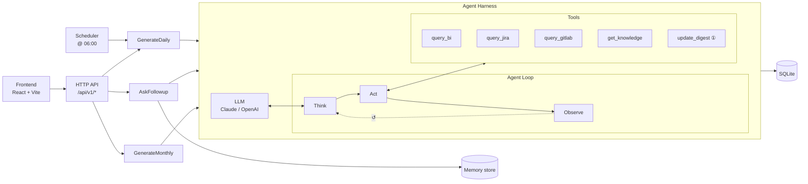

# agentT — Sales / PO Intelligence Agent

A daily-run agentic system that helps a Product Owner understand the Cash Loan product. Every day it reads BI metrics, shipped work (Jira / GitLab), and business rules, then reasons over them to produce a **Daily Digest**: what moved in the per-partner conversion funnel and *why* — with every number traceable to its source.

The PO can ask follow-up questions, correct the digest in conversation, and at month-end the agent synthesizes all daily digests into a **month-over-month report** per partner.

> All external data sources (BI / Jira / GitLab / knowledge base) are mocked today. They sit behind tool ports — swapping in real clients later does **not** touch the agent loop or prompts.

---

## System Design



> ① `update_digest` is wired **only** into the follow-up loop and scoped to a single digest by code — the model cannot write anywhere else.

The loop engine is shared across all three use cases. It stops when the model returns a message with no tool calls (never on `stop_reason`), enforces a hard turn limit, and records every tool call into the digest's audit trail automatically.

---

## Further Steps

- **Frontend digest UI** — list view, per-date digest reader, ask / monthly report pages (the current frontend is the chat scaffold only).
- **Real data sources** — replace mock tool `Run` implementations with live BI SQL, Jira REST, and GitLab API clients; the agent loop and prompts stay identical.
- **Monthly rollup as a background job** — add status polling so the long synthesis does not block the HTTP response.
- **Streaming responses** — stream LLM tokens to the frontend for snappier follow-up Q&A.
- **Multi-tenant** — scope digests and memory by team / product line, not just by date.

---

## How to Run

### Prerequisites

- Go 1.24+
- Node 22+ with pnpm (`corepack enable`)
- An API key for a **tool-calling model** (Claude or OpenAI-compatible). The `echo` stub keeps the server running but cannot produce real digests.

### Backend

```bash
cd backend
cp .env.example .env
# Set ANTHROPIC_API_KEY=sk-ant-...  (or OPENAI_API_KEY=...)
```

```bash
make be-run        # → http://localhost:8080
```

Expected startup log:

```
llm provider: anthropic
digest store: sqlite  path=./digests.db
daily scheduler started  at=06:00 local
server listening  addr=:8080
```

### Frontend

```bash
make fe-install
make fe-dev        # → http://localhost:5173  (proxies /api → backend)
```

### Docker (full stack)

```bash
make up            # docker compose up --build
make down
```

### Try it out

```bash
# Create a daily digest (mock data exists for 2026-03-15)
curl -s -X POST localhost:8080/api/v1/jobs/daily \
  -H 'Content-Type: application/json' \
  -d '{"date":"2026-03-15"}' | jq

# Read the digest
curl -s localhost:8080/api/v1/digests/2026-03-15 | jq

# Ask a follow-up question
curl -s -X POST localhost:8080/api/v1/digests/2026-03-15/ask \
  -H 'Content-Type: application/json' \
  -d '{"userId":"po@vng","question":"Why did CAKE demand rate drop?"}' | jq

# Correct a number (original value is kept in the audit trail)
curl -s -X POST localhost:8080/api/v1/digests/2026-03-15/ask \
  -H 'Content-Type: application/json' \
  -d '{"userId":"po@vng","question":"The SHB E2E rate is wrong, it should be 4.5%. Please fix it."}' | jq

# Generate a monthly rollup (create a few March dates first)
curl -s localhost:8080/api/v1/report/monthly/2026-03 | jq -r .markdown
```

### Configuration

| Variable | Purpose | Default |
|----------|---------|---------|
| `PORT` | backend port | `8080` |
| `LLM_PROVIDER` | `anthropic` / `openai` / `echo` | auto-detected from API key |
| `ANTHROPIC_API_KEY` / `ANTHROPIC_MODEL` | Claude provider | — / `claude-opus-4-8` |
| `OPENAI_API_KEY` / `OPENAI_MODEL` | OpenAI-compatible provider | — / `gpt-4o` |
| `MOCK_DIR` | base dir for mock data tools | `./mock` |
| `DIGEST_DB_PATH` | SQLite digest store path | `./digests.db` |
| `MEMORY_BACKEND` | `memory` (in-process) / `greennode` | auto |

See [`backend/.env.example`](./backend/.env.example) for the full list.

### Makefile targets

```
make be-run      # run backend
make be-build    # build binary → backend/bin/server
make be-test     # go test -race ./...
make be-vet      # go vet
make fe-dev      # Vite dev server
make fe-build    # type-check + production build
make up / down   # docker compose
```
